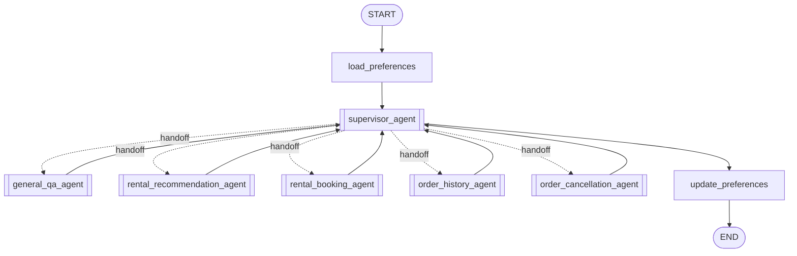

# Multi-Agent Rental Customer Service

一个用于学习 LangGraph 多 Agent 协作的智能租房客服项目。主图本身是 Agent
Supervisor，可通过显式 handoff 连续委派专业 Agent，并统一整理最终回复；五个专业
Agent 根据任务自主选择业务工具。

本项目是独立实现，不在运行时依赖原始 `intelligent_customer_service` 目录。

## 架构



Supervisor 先选择 handoff 目标，专业 Agent 内部再执行 ReAct 工具循环：

```text
用户任务 → Agent 判断 → 调用工具 → 读取工具结果 → 继续调用或生成最终回复
```

注册入口见 `langgraph.json`。所有专业 Agent 都可以在 LangGraph Studio 中单独运行。

## 专业 Agent

| Agent | 可用工具 | 职责 |
| --- | --- | --- |
| `general_qa_agent` | `anysearch_search`、`playwright_read_page`、`analyze_page_visuals` | 自主搜索、选择来源、读取网页或分析视觉证据 |
| `rental_recommendation_agent` | `get_rental_preferences`、`inspect_rental_market`、`search_houses`、`get_house_details`、`request_user_input` | 自主补齐条件、探索市场并推荐真实房源 |
| `rental_booking_agent` | `find_bookable_houses`、`check_booking_availability`、`request_user_input`、`create_booking` | 自主定位房源、检查档期并创建订单 |
| `order_history_agent` | `list_recent_orders`、`search_orders`、`get_order_details` | 自主选择最近、筛选或详情查询 |
| `order_cancellation_agent` | `find_cancellable_orders`、`check_cancellation_eligibility`、`request_user_input`、`cancel_order` | 自主查找、检查资格、确认并软取消订单 |

主图最多连续 handoff 三次，一次只委派一个专业 Agent，同一轮不重复委派同一 Agent。
简单寒暄和能力介绍由 Supervisor 直接回答；专业结果返回共享消息后，由 Supervisor
判断是否继续委派，并最终生成一条用户回复。

所有固定业务子图和固定意图分类器都已移除。每个专业 Agent 只获得领域内的原子工具，并自主选择调用
顺序、参数和停止时机。模型只看到稳定的业务接口，不直接操作任意 SQL 或自由填写
`user_id`；数据库 adapter 使用固定查询模板和参数绑定。

Supervisor 和所有专业 Agent 统一启用官方上下文中间件：较长时先清理旧工具结果，
超过摘要阈值后总结旧对话并保留最近消息。主图 checkpoint 仍持久化完整线程状态。
`update_preferences` 在 Supervisor 最终答复后，用一个节点完成本轮偏好提取、校验和
Store 写入；失败不会覆盖核心业务回复。

推荐、预订和取消 Agent 额外启用 `after_model` 用户输入保护：模型遗漏
`request_user_input`、却用普通文本要求用户补充/选择/确认时，先由硬规则判断，模糊
表达再由结构化 LLM 分类，最后转换成标准工具调用并进入可恢复的 `interrupt`。分类器
失败时 fail-open，不阻断普通最终答复。

## 安全与确定性约束

- `user_id` 从 state、`configurable.user_id` 或开发环境变量解析，不是模型工具参数；
- 房源查询只执行固定 SQL 模板和参数绑定，不向模型开放任意 SQL；
- 手机号和日期在写入工具中由代码再次校验；
- 下单使用参数化 SQL 和可串行化事务；
- 取消工具内部强制执行 `interrupt`，用户确认后才调用软取消；
- 所有订单查询与写入都绑定当前用户；
- Agent 的 `remaining_steps` 限制工具循环，外部依赖失败时工具返回稳定状态。

## 项目结构

```text
.
├── langgraph.json
├── src/agent/
│   ├── supervisor/             # Agent Supervisor 与 handoff 工具
│   ├── agents/                 # 五个专业 ReAct Agent
│   ├── tools/                  # Agent 可见的原子业务工具
│   ├── common/                 # PostgreSQL、LLM、搜索、浏览器、Ollama 适配器
│   ├── node/                   # 统一偏好生命周期节点
│   └── state/                  # Supervisor 公共状态和输入输出 Schema
├── tests/unit_tests/
├── web/
└── sql/house.sql
```

项目不保留旧固定业务子图；正式运行入口全部指向 `supervisor/` 与 `agents/`。

## 安装与运行

```bash
cd /home/lk/langchain/agent
python3.12 -m venv .venv
source .venv/bin/activate
python -m pip install -e ".[dev]"
cp .env.example .env
set -a && source .env && set +a
playwright install chromium
```

至少配置：

```dotenv
DEEPSEEK_API_KEY=...
POSTGRES_URI=postgresql://...
CHAT_USER_ID=demo-user
CHAT_THREAD_ID=demo-thread
```

启动 Agent Server：

```bash
langgraph dev
```

启动示例 Web 客户端：

```bash
python web/app.py
```

浏览器访问 `http://127.0.0.1:8080`。

## 测试

测试使用假模型和假数据库，不调用 DeepSeek：

```bash
python -m unittest discover -s tests/unit_tests -p "test_*.py"
```

测试覆盖 Supervisor handoff、三次委派上限、工具循环、Agent 中断恢复、运行时身份、
参数化查询、预订单次写入、取消确认和统一上下文中间件。

## 数据说明

`sql/house.sql` 包含房源表结构与演示数据，文件开头会删除已有 `house` 表。只应导入到
明确的开发数据库，不能直接用于已有生产数据库。
