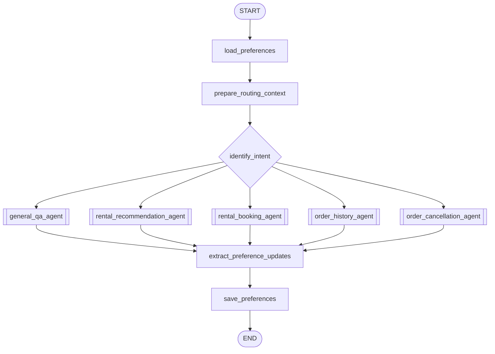

# Multi-Agent Rental Customer Service

一个用于学习 LangGraph 多 Agent 协作的智能租房客服项目。主图采用受控 Supervisor，
只负责公共身份、意图路由和偏好持久化；五个专业 Agent 根据任务自主选择业务工具。

本项目是独立实现，不在运行时依赖原始 `intelligent_customer_service` 目录。

## 架构



每个专业 Agent 内部都是相同的 ReAct 工具循环：

```text
用户任务 → Agent 判断 → 调用工具 → 读取工具结果 → 继续调用或生成最终回复
```

注册入口见 `langgraph.json`。所有专业 Agent 都可以在 LangGraph Studio 中单独运行。

## 专业 Agent

| Agent | 可用工具 | 职责 |
| --- | --- | --- |
| `general_qa_agent` | `search_web` | 直接问答或获取实时网页证据 |
| `rental_recommendation_agent` | `get_rental_preferences`、`request_user_input`、`search_houses` | 补齐条件并推荐真实房源 |
| `rental_booking_agent` | `request_user_input`、`create_booking` | 收集信息并创建订单 |
| `order_history_agent` | `list_recent_orders` | 查询当前用户历史订单 |
| `order_cancellation_agent` | `find_cancellable_orders`、`request_user_input`、`cancel_order` | 选择、确认并软取消订单 |

`database_query`、网页证据处理和信息补充不是额外 Agent，而是隐藏复杂实现的深工具。
模型只看到稳定的业务接口，不直接操作任意 SQL 或自由填写 `user_id`。

## 安全与确定性约束

- `user_id` 从 state、`configurable.user_id` 或开发环境变量解析，不是模型工具参数；
- 房源查询继续使用表白名单、结构化查询计划、本地只读校验和数据库只读事务；
- 手机号和日期在写入工具中由代码再次校验；
- 下单使用参数化 SQL 和可串行化事务；
- 取消工具内部强制执行 `interrupt`，用户确认后才调用软取消；
- 所有订单查询与写入都绑定当前用户；
- Agent 的 `remaining_steps` 限制工具循环，外部依赖失败时工具返回稳定状态。

## 项目结构

```text
.
├── langgraph.json
├── src/agent/
│   ├── supervisor/             # 主路由图
│   ├── agents/                 # 五个专业 ReAct Agent
│   ├── tools/                  # Agent 可见的深业务工具
│   ├── common/                 # PostgreSQL、LLM、搜索、浏览器、Ollama 适配器
│   ├── graph/                  # 工具内部工作流及原流程对照实现
│   ├── node/                   # 可复用的确定性业务实现
│   └── state/                  # 公共状态和输入输出 Schema
├── tests/unit_tests/
├── web/
└── sql/house.sql
```

`graph/` 中未注册的旧业务图保留为学习对照和回归测试基线；正式运行入口全部指向
`supervisor/` 与 `agents/`。

## 安装与运行

```bash
cd /home/lk/langchain/agent
python3.12 -m venv .venv
source .venv/bin/activate
python -m pip install -e ".[dev]"
cp .env.example .env
set -a && source .env && set +a
playwright install chromium
```

至少配置：

```dotenv
DEEPSEEK_API_KEY=...
POSTGRES_URI=postgresql://...
CHAT_USER_ID=demo-user
CHAT_THREAD_ID=demo-thread
```

启动 Agent Server：

```bash
langgraph dev
```

启动示例 Web 客户端：

```bash
python web/app.py
```

浏览器访问 `http://127.0.0.1:8080`。

## 测试

测试使用假模型和假数据库，不调用 DeepSeek：

```bash
python -m unittest discover -s tests/unit_tests -p "test_*.py"
```

测试同时保留原业务安全回归，并新增 Supervisor、工具循环、Agent 中断恢复、运行时身份、
预订单次写入和取消确认测试。

## 数据说明

`sql/house.sql` 包含房源表结构与演示数据，文件开头会删除已有 `house` 表。只应导入到
明确的开发数据库，不能直接用于已有生产数据库。
