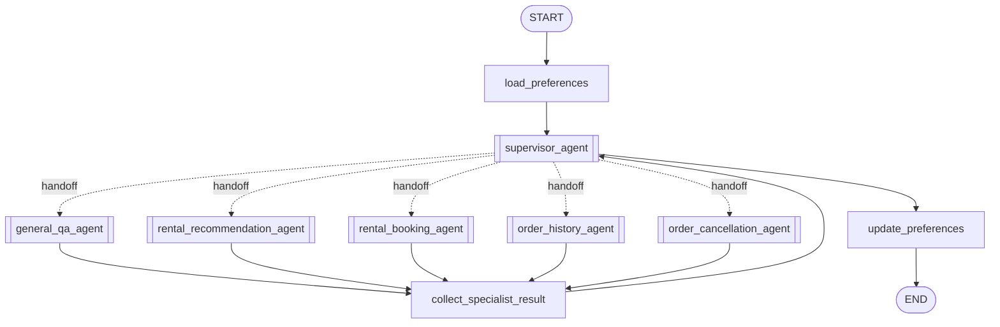

# 智能租房客服：多 Agent 架构与运行说明

## 1. 项目目标

这是一个用于学习 LangGraph Agent 编排的智能租房客服项目。主图使用 Agent
Supervisor 理解用户目标并动态 handoff；五个专业 Agent 在自己的职责范围内，通过
ReAct 循环自主选择工具、生成参数、读取结果并决定何时结束。

项目重点展示：

- Supervisor 如何把多意图请求拆成明确的专业任务；
- 专业 Agent 如何组合多个原子工具，而不是执行固定节点路径；
- handoff、共享状态、上下文投影和结构化结果如何配合；
- 预订、取消等流程如何在工具内部执行校验、interrupt 和恢复；
- 中间件如何统一管理上下文、执行预算和工具选择原因；
- checkpoint、Store、LangGraph Studio 和 LangSmith 如何支持调试。

项目是独立实现，运行时不依赖原始 `intelligent_customer_service` 目录，也不保留旧的
固定业务子图。

## 2. 总体架构



主流程为：

1. `load_preferences` 加载当前用户偏好，并初始化当前业务轮状态；
2. Supervisor 判断是直接回复，还是调用一个 `delegate_to_*` handoff 工具；
3. handoff 使用 `Command.PARENT` 回到主图并动态跳转到目标专业 Agent；
4. 专业 Agent 自主调用领域工具，最终生成 `SpecialistResult`；
5. `collect_specialist_result` 将结果挂到对应委派记录，并清空临时结果；
6. Supervisor 读取结构化专业结果，决定继续委派还是生成最终回复；
7. 最终回复完成后，`update_preferences` 提取并保存本轮明确变化的租房偏好。

Supervisor 单轮最多连续委派三次，每次只能选择一个专业 Agent，同一轮不能重复委派
同一个专业 Agent。简单寒暄、能力介绍和必要的路由澄清由 Supervisor 直接处理。

## 3. 专业 Agent 与工具

| Agent | 职责 | 可用工具 |
| --- | --- | --- |
| `general_qa_agent` | 常规知识、新闻、天气、政策和联网研究 | `anysearch_search`、`playwright_read_page`、`analyze_page_visuals` |
| `rental_recommendation_agent` | 收集条件、探索市场并推荐真实房源 | `get_rental_preferences`、`inspect_rental_market`、`request_user_input`、`search_houses`、`get_house_details` |
| `rental_booking_agent` | 定位房源、检查档期并创建预订 | `find_bookable_houses`、`check_booking_availability`、`request_user_input`、`create_booking` |
| `order_history_agent` | 查询最近订单、筛选订单和读取详情 | `list_recent_orders`、`search_orders`、`get_order_details` |
| `order_cancellation_agent` | 查找可取消订单、检查资格并安全取消 | `find_cancellable_orders`、`check_cancellation_eligibility`、`request_user_input`、`cancel_order` |

每个专业 Agent 只获得职责范围内的工具。模型可以自主决定：

- 是否需要调用工具；
- 先调用哪个工具；
- 如何根据上一个工具结果生成下一个工具参数；
- 是否需要用户补充或确认信息；
- 证据何时足够，以及何时返回最终结果。

工具接口保持稳定，数据库、HTTP、Playwright、视觉模型等实现隐藏在工具内部。模型不能
执行任意 SQL，也不能自由指定可信的 `user_id`。

## 4. Handoff 与任务拆分

Supervisor 为每个专业 Agent 提供一个 `delegate_to_*` 工具。工具调用至少包含：

```json
{
  "task": "查询当前用户最近三个月的租房订单",
  "selection_reason": "用户要求查看自己的历史订单"
}
```

`task` 是 Supervisor 从当前用户目标中提炼出的完整、可执行任务；
`selection_reason` 是简短的路由依据，用于 Studio 和 LangSmith 观察，不应包含详细推理、
系统提示词或内部上下文。

handoff 工具返回父图命令：

```python
Command(
    graph=Command.PARENT,
    goto="order_history_agent",
    update={
        "messages": [...],
        "delegations": [...],
    },
)
```

`Command.PARENT` 会跳出嵌套的 Supervisor Agent 图，回到客服主图，再动态调度目标专业
Agent。主图在 handoff 时不会提前执行偏好更新。

## 5. 主 Agent 与子 Agent 的上下文传递

当前实现不是“每个专业 Agent 一份完全独立历史”，而是：

```text
共享完整状态
  + handoff task明确当前目标
  + Supervisor模型使用结构化投影视图
```

### 5.1 主图持久状态

`CustomerServiceState` 包含：

- `messages`：用户、Supervisor、专业 Agent 和工具产生的共享消息；
- `delegations`：本轮委派任务、选择原因、调用 ID 和可选专业结果；
- `structured_response`：专业 Agent 刚生成的临时结构化结果；
- `specialist_budget`：当前专业任务的模型和业务工具预算；
- `last_guard_event`：最近一次用户输入等待判定；
- `user_id`、`user_preferences`、`preference_status` 等偏好状态。

主图 checkpoint 保存线程执行状态，支持 Studio 排错和 interrupt 恢复。

### 5.2 父状态进入专业 Agent

父图与子图按同名状态通道传递字段。专业 Agent 主要接收：

- `messages`；
- `specialist_budget`；
- `structured_response`；
- 带 Guard 的 Agent 还会接收 `last_guard_event`。

`delegations`、`user_preferences` 等不属于专业 Agent 的直接状态接口。需要用户身份的工具
从 `ToolRuntime` 的 state、context、config 或开发环境变量中解析；需要跨会话偏好的工具
通过 LangGraph Store 读取。

专业 Agent 会收到共享 `messages` 历史，当前任务由最新 handoff `ToolMessage` 中的
`task` 明确。因此后执行的专业 Agent 目前可能看到此前专业 Agent 的内部消息；项目尚未
为每个专业 Agent 增加独立的消息投影。

### 5.3 专业结果返回 Supervisor

专业 Agent 的原始 AI 消息和业务工具结果仍保留在共享状态中，但
`SupervisorContextProjectionMiddleware` 会在每次 Supervisor 模型调用前创建临时视图：

- 保留所有用户消息；
- 保留 Supervisor 自己的消息和 handoff 调用；
- 移除专业 Agent 的普通 AI 消息；
- 移除普通业务工具返回；
- 将 handoff `ToolMessage` 改写为 `task + selection_reason + SpecialistResult`。

投影只修改本次 `ModelRequest.messages`，不会直接覆盖 checkpoint 中的原始消息。这使
Supervisor 能够根据紧凑结果继续规划，同时保留内部执行轨迹供调试。

当前投影需要注意一个限制：`SummarizationMiddleware` 生成的是 `HumanMessage`，而投影
会保留所有 `HumanMessage`。如果长上下文摘要包含专业 Agent 内部细节，可能绕过普通消息
类型过滤；后续可以增加专业 Agent 投影或识别摘要来源，进一步隔离内部上下文。

## 6. `SpecialistResult` 结构化结束接口

所有专业 Agent 使用统一结果结构：

```python
class SpecialistResult(TypedDict):
    agent: SpecialistName
    status: Literal["success", "needs_input", "failed"]
    summary: str
    user_facing_answer: str
    completed_tasks: list[str]
    remaining_tasks: list[str]
```

`create_agent(response_format=SpecialistResult)` 会把 Schema 转换为模型可调用的结构化输出
接口。正常情况下，LLM 生成名为 `SpecialistResult` 的 tool call；LangChain 在模型节点
内部校验参数，写入 `state["structured_response"]`，然后结束专业 Agent。它对模型表现为
工具，但不是需要业务 `ToolNode` 执行的普通 Python 工具。

`collect_specialist_result` 随后：

1. 校验结构化结果是否存在；
2. 找到最近一条尚未完成的委派记录；
3. 使用 handoff 路由身份覆盖模型填写的 `agent`；
4. 写入 `delegations[n].result`；
5. 清空临时 `structured_response`，避免下次委派误用旧结果。

## 7. 公共中间件

### 7.1 上下文管理

Supervisor 和专业 Agent 默认使用两层上下文管理：

| 中间件 | 触发条件 | 行为 | 是否调用 LLM | 是否直接更新消息状态 |
| --- | --- | --- | ---: | ---: |
| `ContextEditingMiddleware` | 约 8,000 tokens | 清理较早的大型工具调用和结果，至少释放约 2,000 tokens，保留最近 3 次工具使用 | 否 | 否，只修改本次模型请求副本 |
| `SummarizationMiddleware` | 约 12,000 tokens | 总结旧对话并保留最近 20 条消息 | 是 | 是 |

`ContextEditingMiddleware` 使用 `wrap_model_call`，不会显示为独立图节点；
`SummarizationMiddleware` 使用 `before_model`，因此会显示在 Studio 图中。

### 7.2 工具选择原因

所有 LLM 可见业务工具要求填写 `selection_reason`。`ToolSelectionReasonMiddleware` 使用
`wrap_tool_call` 包裹工具执行，把模型填写的原因统一写回对应 `ToolMessage`。原因与
`tool_call_id` 天然关联，适合并行工具调用，也不需要每个业务工具重复拼装可观测字段。

### 7.3 专业 Agent 执行预算

`SpecialistBudgetMiddleware` 使用多个生命周期钩子：

- `before_agent`：按 handoff 或最新用户消息识别新任务并初始化预算；
- `before_model`：增加模型调用次数并设置是否禁止下一次真实调用；
- `wrap_model_call`：隐藏业务工具、跳过真实 LLM 或替换不合规响应；
- `after_model`：统计、截断模型刚生成的业务工具调用，并设置最终尝试状态。

当前预算为：

| Agent | 业务工具调用上限 | 模型调用上限 |
| --- | ---: | ---: |
| `general_qa_agent` | 9 | 12 |
| `rental_recommendation_agent` | 8 | 12 |
| `rental_booking_agent` | 6 | 12 |
| `order_history_agent` | 4 | 12 |
| `order_cancellation_agent` | 6 | 12 |

`request_user_input` 和 `SpecialistResult` 不计入业务工具调用次数。额度耗尽后，下一次模型
调用会隐藏普通业务工具，只允许模型生成结构化结果；如果模型仍不遵守，代码直接生成
失败的 `SpecialistResult`。

### 7.4 中间件顺序

中间件按列表注册，但执行方向取决于钩子：

- `before_*` 按注册顺序执行；
- `after_*` 按注册顺序反向执行；
- `wrap_*` 使用洋葱模型，列表第一项位于最外层。

以带 Guard 的专业 Agent 为例，主要顺序为：

```text
Summarization.before_model
 → SpecialistBudget.before_model
 → ContextEditing.wrap_model_call
   → SpecialistBudget.wrap_model_call
     → model
   ← SpecialistBudget.wrap_model_call
 ← ContextEditing.wrap_model_call
 → UserInputGuard.after_model
 → SpecialistBudget.after_model
```

## 8. 用户输入等待、interrupt 与恢复

推荐、预订和取消 Agent 配置了 `UserInputGuardMiddleware.after_model`。正常情况下，模型
缺少信息时应调用 `request_user_input`；如果模型错误地只返回“请提供手机号”之类普通
文本，默认 Agent 会直接结束，无法产生 interrupt。

Guard 在模型调用后执行：

1. 已有 tool call 时不干预；
2. 明确的请求或结束语先用硬规则判断；
3. 模糊文本使用结构化 LLM 分类；
4. 确实需要用户输入时，把原 AI 消息替换为 `request_user_input` tool call；
5. Agent 内置 `ToolNode` 执行工具，并在工具内部产生 interrupt。

恢复时使用 `Command(resume=...)` 回到原工具。工具返回 `ToolMessage` 后，专业 Agent继续
原来的 ReAct 循环，不重新经过 Supervisor 路由。Guard 只检查新的 AI 输出，不会对同一
次中断重复注入工具。

订单取消还有更强的确定性保护：`cancel_order` 工具内部始终中断一次，只有恢复值通过
确认规则后才执行软取消。模型声称“用户已经确认”不能绕过该工具保护。

## 9. General QA 联网研究

General QA 按证据需要自主组合三个工具：

1. `anysearch_search` 返回候选标题、URL和摘要，不直接读取网页正文；
2. `playwright_read_page` 读取 JavaScript 渲染后的正文和 JSON 响应；
3. `analyze_page_visuals` 仅在文本和 JSON 不足时截取首屏并调用 Ollama视觉模型。

`playwright_read_page` 当前接口为：

```python
playwright_read_page(
    urls: list[str],        # 1～4个URL
    selection_reason: str,
)
```

需要多个来源时，模型应在一次工具调用中提交多个 URL。工具会：

- 按首次出现顺序去重；
- 每批最多接收 4 个不同 URL；
- 一次启动一个 Chromium；
- 最多并发读取 3 个页面；
- 每个 URL 使用独立 BrowserContext；
- 保持输入和输出顺序一致；
- 单页失败时返回 `partial_success`，不丢弃其他成功页面。

网页读取只允许访问当前用户明确提供或本轮 AnySearch 返回的 URL，并拒绝本机、内网和
非 HTTP(S) 地址。HTTP错误、人机验证和浏览器失败按页面返回稳定错误，不把截图 Base64
泄露给文本 Agent。

## 10. 偏好、Store 与 checkpoint

### 偏好 Store

`load_preferences` 在主图入口从 LangGraph Store 读取跨会话偏好；
`update_preferences` 只分析当前业务轮明确表达的变化，在 Supervisor 最终答复后原子合并
保存。偏好读取或写入失败只记录诊断状态，不覆盖核心业务回复。

专业 Agent 需要偏好时通过 `get_rental_preferences` 工具读取 Store，保持工具接口与父图
状态解耦。

### checkpoint

Agent Server 使用 `AsyncPostgresSaver`：

- 服务启动时自动执行 `setup()` 创建 checkpoint 表；
- `thread_id` 标识会话线程；
- interrupt 恢复依赖相同 `thread_id`；
- checkpoint 用于保存消息、委派记录、执行预算和 Guard 诊断。

Store 负责跨会话长期数据，checkpoint 负责单个执行线程的可恢复状态，两者职责不同。

## 11. 安全和确定性约束

- `user_id` 由 state、runtime context、`configurable.user_id` 或开发变量解析，不作为 LLM
  可自由填写的工具参数；
- 房源和订单访问使用固定 adapter、参数绑定和用户过滤，不向模型开放任意 SQL；
- 手机号、日期和房源身份在写工具内部再次校验；
- 创建订单使用参数化 SQL 和事务；
- 取消订单在工具内部执行资格检查、用户确认和软取消；
- 网页工具只访问已批准 URL，并阻止明显 SSRF 地址；
- 工具错误转换为稳定 JSON，避免把数据库或内部堆栈直接暴露给模型和用户；
- `selection_reason` 只允许一句简短依据，不允许详细思维链或系统上下文。

## 12. 项目结构

```text
.
├── langgraph.json                 # Agent Server图注册与checkpointer配置
├── src/agent/
│   ├── supervisor/
│   │   ├── graph.py               # 客服主图
│   │   ├── handoff.py             # delegate_to_* 工具与Command.PARENT
│   │   └── context.py             # Supervisor模型上下文投影
│   ├── agents/
│   │   ├── factory.py             # 专业Agent与公共中间件装配
│   │   ├── specialist_budget.py   # 模型和业务工具硬预算
│   │   ├── user_input_guard.py    # 普通文本等待用户的兜底
│   │   └── *.py                   # 五个专业Agent
│   ├── tools/                     # LLM可见原子业务工具
│   ├── common/                    # 数据库、搜索、浏览器、视觉和LLM adapter
│   ├── node/preferences.py        # 偏好加载、提取与保存
│   ├── state/                     # 主图和偏好状态接口
│   └── checkpointer.py            # PostgreSQL checkpoint工厂
├── tests/unit_tests/
├── web/
└── sql/house.sql
```

`langgraph.json` 注册客服主图和五个可独立调试的专业 Agent。

## 13. 安装与运行

```bash
cd /home/lk/langchain/agent
python3.12 -m venv .venv
source .venv/bin/activate
python -m pip install -e ".[dev]"
cp .env.example .env
playwright install chromium
```

至少配置：

```dotenv
DEEPSEEK_API_KEY=...
POSTGRES_URI=postgresql://...
CHAT_USER_ID=demo-user
CHAT_THREAD_ID=demo-thread
```

联网研究还需要：

```dotenv
ANYSEARCH_API_KEY=...
OLLAMA_BASE_URL=http://127.0.0.1:11434
OLLAMA_VISION_MODEL=qwen3-vl:4b-instruct
```

启动 Agent Server：

```bash
source .venv/bin/activate
langgraph dev
```

启动示例 Web 客户端：

```bash
python web/app.py
```

浏览器访问 `http://127.0.0.1:8080`。

## 14. 测试与调试

运行完整测试：

```bash
PYTHONDONTWRITEBYTECODE=1 python -m unittest discover -s tests
```

测试使用假模型和假 adapter，不要求真实调用 DeepSeek。主要覆盖：

- Supervisor handoff、连续委派和重复委派限制；
- `SpecialistResult` 结构化完成与预算兜底；
- 专业 Agent 工具自主循环；
- interrupt、恢复和取消确认；
- 工具选择原因与 Supervisor 上下文投影；
- General QA 搜索、批量网页读取和视觉选择；
- 用户身份、参数校验、数据库访问和偏好生命周期。

在 LangGraph Studio 中可以单独选择任一专业 Agent，查看模型、工具和中间件节点；
`wrap_model_call`、`wrap_tool_call` 等包装型中间件不会显示为独立节点，但会出现在
LangSmith trace 中。启用：

```dotenv
LANGSMITH_TRACING=true
LANGSMITH_API_KEY=...
LANGSMITH_PROJECT=multi-agent-rental-service
```

调试 interrupt 时必须使用稳定的 `thread_id`；恢复不是重新发送普通用户请求，而是向
同一线程提交 `Command(resume=...)`。
